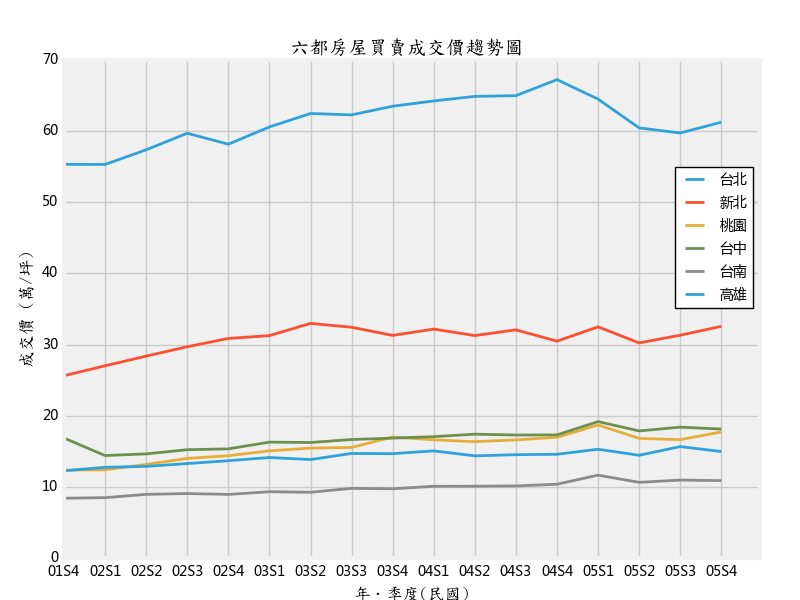

# lvrland-dv
Data Visualization for lvr data 

## Open Data

資料來源為內政部不動產交易實價查詢網： [不動產成交案件實際資訊Open Data](http://plvr.land.moi.gov.tw/DownloadOpenData)

## Data Preprocessing

### 資料轉檔：

    iconv -c -f big5 -t utf-8 source.csv > target.csv

### 中文字型

- Global Setting
	1. _%Python Install Dir%_\Lib\site-packages\matplotlib\mpl-data
    2. 複製字型 (實測不用)
        - source: C:\Windows\Fonts\DFKai-SB
        - target: _%Python Install Dir%_\Lib\site-packages\matplotlib\mpl-data\fonts\ttf\DFKai-SB
    3. **matplotlibrc**: remove comment, then add "DFKai-SB" (or 'KaiTi', 'SimHei', 'FangSong' ...)
```
	    font.family         : sans-serif
	    font.sans-serif     : DFKai-SB, Bitstream Vera Sans, Lucida Grande...
        axes.unicode_minus  : False # 解决坐标轴负数的负号显示问题
```
- Hard code (**Matplotlib**)
```
	font = {'family': 'DFKai-SB'}
	plt.rc('font', **font)               # 步骤一（设置字体的更多属性）
    plt.rc('axes', unicode_minus=False)  # 步骤二（解决坐标轴负数的负号显示问题）
```
or
```
	font = font_manager.FontProperties(fname='fonts/msyh.ttc', size=12)
	plt.xlabel("x軸") 
	plt.ylabel("y軸", fontproperties=font)
	plt.title("標題", fontproperties="KaiTi")
```

- Hard code: [matplotlib显示中文](http://www.cnblogs.com/hhh5460/p/4323985.html)
- 全域設定: [解決Matplotlib中文亂碼問題](http://www.wnqzw.com/article/9077.html)
- 字型對照： [Matplotlib輸出中文顯示問題](http://fanli7.net/a/bianchengyuyan/C__/20140615/517613.html)

## Chart

### Scatterplot
- 分區成交量: lvr_scatterplot.py

### Line
- 成交量趨勢: lvr_volume_plot.py
- 成交價趨勢: lvr_urban_plot.py

### Bar
- 分區成交量: lvr_district_bar.py, lvr_stacked_bar.py
- 月份成交量: lvr_season_bar.py

### Pie
- 總面積: lvr_area_pie.py
- 成交價: lvr_pie.py

